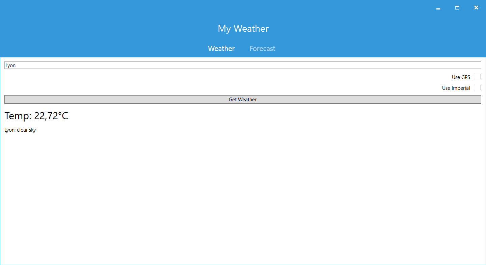
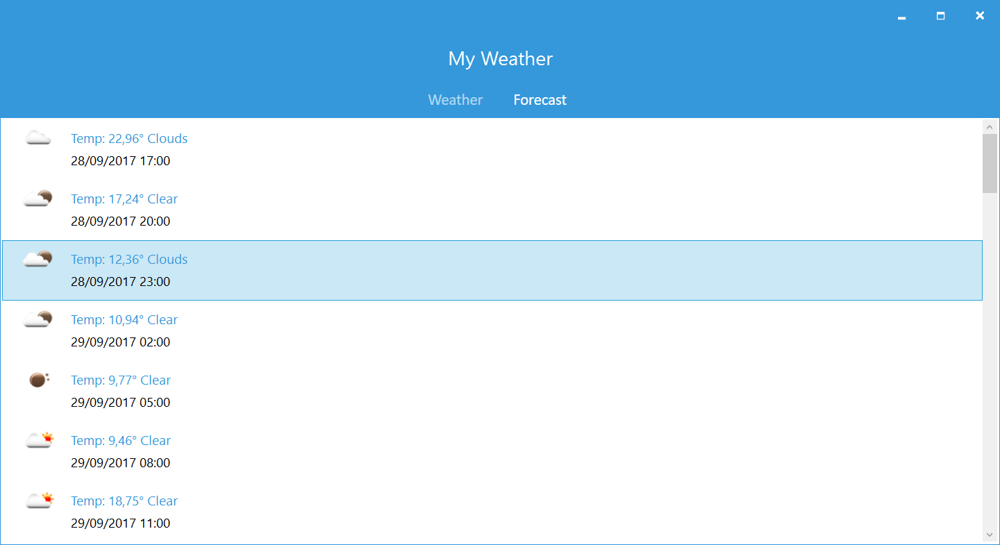

MyWeather.Forms
===================

This is a small sample application showing how to query OpenWeatherMap.org to gather weather for a current location.

Built with C# 6 features, you must be running VS 2015 or Xamarin Studio to compile. 

Built with Xamarin.Forms with support for:
* iOS
* Android
* UWP
* WPF

Grabs current weather and 5 day forecast.

## WPF ##

### Getting Started ###

This project requires two libraries:
- Xamarin.Forms.Platform.WPF: Xamarin Forms WPF Backend
- WpfLightToolkit: It's a collection of helper functions and custom controls for Xamarin.Forms WPF Backend.

To test this project you must add this two Nuget sources in Visual Studio:
- Xamarin.Forms WPF CI: https://ci.appveyor.com/nuget/xamarin-forms-wpf-ci
- WpfLightToolkit CI: https://ci.appveyor.com/nuget/wpflighttoolkit-ci

### Images ###

